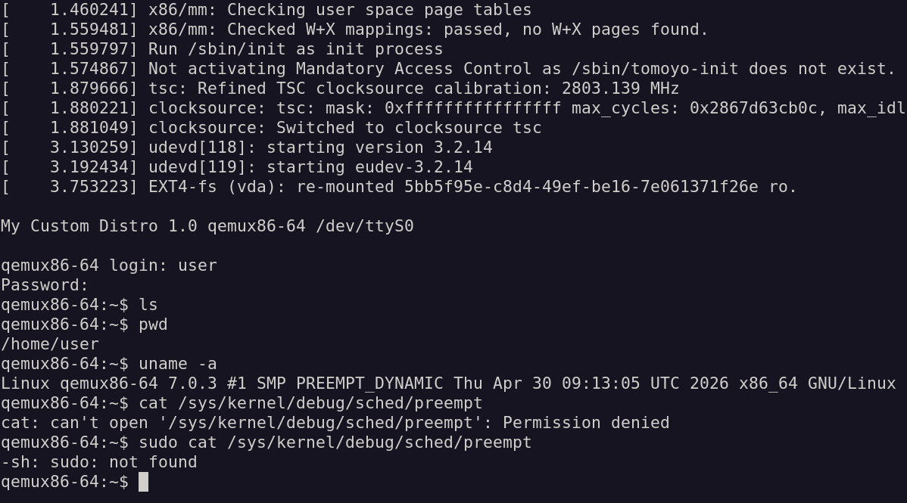

## Author

Thierry Vilmart

2026

## Poky version

The Yocto build was made to work with 2 different poky versions.

- scarthgap 5.0 (LTS), on the branch tag v1.0-scarthgap

- the new wrynose 6.0 (LTS) that will be released in the first week of May 2026

The version 6.0 is useful for using Rust and avoid memory leaks. It is also useful to have a better dependencies SBOM report and CVE vulnerabilities report. Version 6 had a more modern toolchain and it uses UNPACKDIR for cleaner builds with less bugs.

This file below will need to be changed when wrynose is officially released.

```
bitbake-builds/mydistro-wrynose/config/config-upstream.json
"branch": "wrynose",
"rev": "sha..."
```

## Buildable Yocto distro with kernel 7 and CVE/SBOM generation

    - Custom mydistro layer targeting qemux86-64 with glibc
    - Linux 7.0.3 via custom kernel recipe
    - The kernel config is calculated from the unchanged config with a minimal diff fragment manually applied (linux-kernel7_7.0.bb)
    - SBOM and CVE reports generated via the new fragment core/yocto/sbom-cve-check in the poky version 6.0
    - Root account locked, non-root user provisioned via extrausers
    - Working support for running in a qemu VM (see screenshot)
    - Possible to login with a non-privileged user (no sudo)

## Here lies a nice qemu run that shows:

    - the kernel 7 version
    - a login with a non-privileged user (no sudo)



## How to use this Yocto setup it

https://docs.yoctoproject.org/brief-yoctoprojectqs/index.html

It is buildable using:
```sh
git clone -b yocto-5.3.3 https://git.openembedded.org/bitbake
./bitbake/bin/bitbake-setup update
# we keep here for documentation the creation command that was then modified (changed poky)
#./bitbake/bin/bitbake-setup init --non-interactive poky-master poky distro/poky machine/qemux86-64 --setup-dir-name mydistro-wrynose
source ./bitbake-builds/mydistro-wrynose/build/init-build-env
bitbake mydistro-image
runqemu nographic ./tmp/deploy/images/qemux86-64/mydistro-image-qemux86-64.rootfs.ext4
```

## SBOM and CVEs

The vulnerabilities report and the list of dependencies (SBOM) are generated.
```
# CVEs:
mydistro-image-qemux86-64.rootfs.sbom-cve-check.yocto.json
# SBOM:
mydistro-image-qemux86-64.rootfs.spdx.json

bitbake -g mydistro-image
# result files: pn-buildlist, task-depends.dot
```

